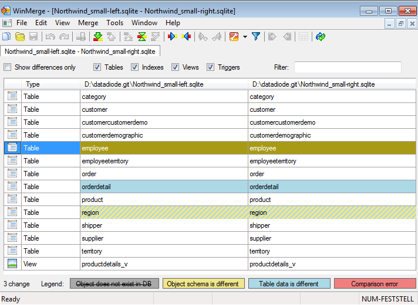
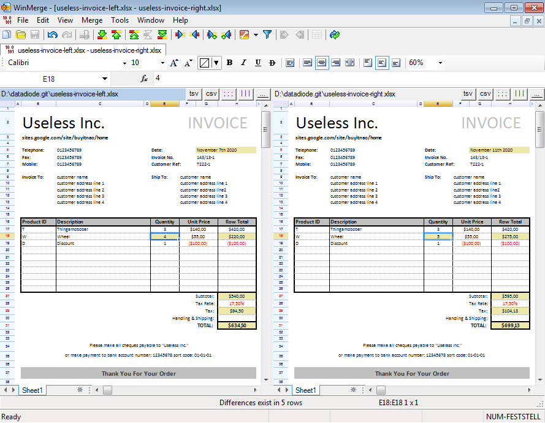

WinMerge 2011 was long ago forked from WinMerge, when the project was in a dead end.
Meanwhile, [winmerge.org](https://winmerge.org/) abandoned their original codebase in favor of [Takashi's fork](https://github.com/WinMerge/winmerge),
whose development is driven forward with enthusiasm. Development of WinMerge 2011 has not entirely ceased, but is a sporadic business.

### November 2020 brings new features to WinMerge 2011

  
*SQLite 3 database file comparison powered by [SQLite Compare](https://github.com/datadiode/SQLiteCompare)*

  
*Excel .xlsx file comparison powered by [ReoGrid](https://github.com/datadiode/ReoGrid)*

### Installers
WinMerge 2011 installers come in the form of .CPL files, because .EXE files seem to be more prone to DLL injection attacks. You can also opt to extract the contained files using 7-Zip, in which case the application will maintain its settings in a .json file rather than in the Windows Registry (unless you prevent this by deleting the .json file after extraction).

### Continuous Integration
You may want to try the
[latest unreleased version](https://ci.appveyor.com/project/datadiode/winmerge2011/build/artifacts).
